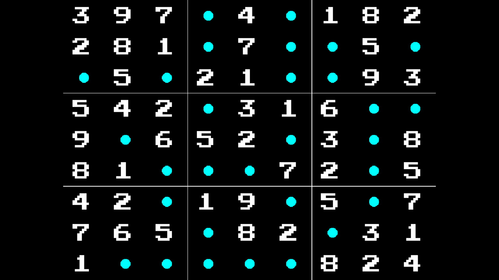

# Sudoku Game (VB.NET & Python)



## Description
This project implements a classic Sudoku puzzle game in two programming languages:
- **VB.NET**: Uses @DualBrain's `vbPixelGameEngine` for rendering
- **Python**: Uses Pygame library for graphics and user input

Both implementations share similar core functionality with a user-friendly interface and visual feedback.

## Features
- **Dynamic Sudoku Generation**: Creates valid Sudoku puzzles with customizable difficulty (30-50 blanks)
- **Interactive Gameplay**: Click to select cells and enter numbers using keyboard
- **Visual Feedback**: Color-coded cells (cyan for editable, white for fixed, yellow for selected)
- **Grid System**: Clear grid with thicker lines separating 3x3 subgrids
- **Win Detection**: Automatically detects when the Sudoku is completed correctly
- **Quit Option**: Press "Escape" to exit the game at any time

## Prerequisites

### VB.NET Version
- [Visual Studio 2026](https://visualstudio.microsoft.com/vs/)
- [.NET 10.0 SDK](https://dotnet.microsoft.com/en-us/download/dotnet/10.0)
- `vbPixelGameEngine.dll` (included in the project)

### Python Version
- [Python 3.11+](https://www.python.org/downloads/release/python-3110/)
- Pygame library: Install using `pip install pygame`

## Installation & How to Run
First, clone the repository and navigate to the project directory:
```bash
git clone https://github.com/Pac-Dessert1436/Sudoku-Game-VBPGE-Python.git
cd Sudoku-Game-VBPGE-Python
```

### VB.NET Version
1. Open the solution in Visual Studio 2026
2. Build the project (Ctrl+Shift+B)
3. Run the application (F5)

### Python Version
```bash
python sudoku_game.py
```

## Game Controls

### Common Controls
- **Mouse Click**: Select a cell
- **Numbers 1-9**: Enter a number into the selected cell
- **Escape Key**: Exit the game

### Game Flow
1. When starting, you'll be prompted to enter the number of blanks (30-50)
2. Click on any blank cell (cyan) to select it
3. Press a number key (1-9) to fill the cell
4. The game will automatically detect when you've completed the Sudoku correctly
5. A "Congratulations! You Win!" message will appear when completed

## Implementation Details

### Sudoku Generation Algorithm
Both versions use a similar algorithm to generate valid Sudoku puzzles:
1. Start with a base valid Sudoku board
2. Shuffle rows within each band (groups of 3 rows)
3. Shuffle columns within each stack (groups of 3 columns)
4. Apply a number permutation to randomize values
5. Remove a specified number of cells to create blanks

### Win Condition Check
The game checks for completion by verifying:
- All cells are filled (no zeros)
- Each row contains unique numbers 1-9
- Each column contains unique numbers 1-9
- Each 3x3 subgrid contains unique numbers 1-9

## Project Structure
```
Sudoku-Game-VBPGE-Python/
├── Program.vb          # VB.NET implementation
├── sudoku_game.py      # Python implementation
├── vbPixelGameEngine.dll # VB.NET engine dependency
├── screenshot.png      # Game screenshot
├── README.md          # This file
└── LICENSE            # MIT License
```

## License
This project is licensed under the MIT License. See the [LICENSE](LICENSE) file for details.